# DesignPatterns-Swift-App

## 初级

### MVC

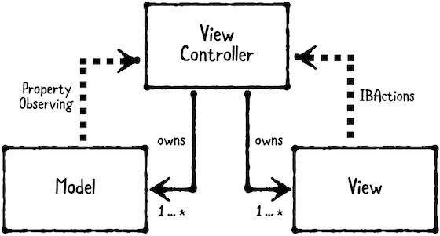

- **Models** 持有数据
- **Views** 展示视图和控件，通常是 `UIView` 的子类
- **Controllers** 协调 `Model` 和 `View`，通常是 `UIViewController` 的子类

### Delegation委托

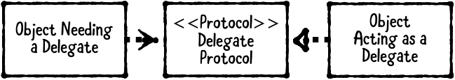

- 一个**委托者**，即一个对象有一个委托者来，为避免引用循环，委托者通常是一个弱引用
- 一个**协议**，定义了可能需要实现的方法
- 一个**代理**，是一个实现了代理协议的委托对象

依赖一个协议而不是一个实体对象，实现方法起来就更加灵活，因为所有实现了这个协议的对象都可作为代理。

> 使用场合：
>
> 把比较庞大的类拆解，创建泛型或可重用的组建。

> **注意：**
>
> 代理模式容易被滥用，在一个对象需要很多代理的情况下，避免给一个对象创建过多的代理，这时就需要考虑拆分这个对象的功能。
>
> 同样地，如果你不明白这个代理的有用之处，那么就代表你拆分过细了，并且不需要这个代理。
>
>  如果一个对象一定有一个代理，可以考虑把它添加到 `init` 方法里，并且使用 `!` 而不是 `?` 来隐式解包

ControllerA

```swift
protocol ADelegate {
  func doSomething(_ aClass: A, at index: Int)
}

class A {
  weak var delegate: ADelegate?
  func performSomeAction() {
    delegate?.doSomething(self, at: 0)
  }
}
```

ControllerB

```swift
class B: ADelegate {
  func showA() {
    let a = A()
    a.delegate = self
  }
  
  func doSomething(_ aClass: A, at index: Int) {
    //TODO:- handle call back
  }
}
```

### Strategy策略

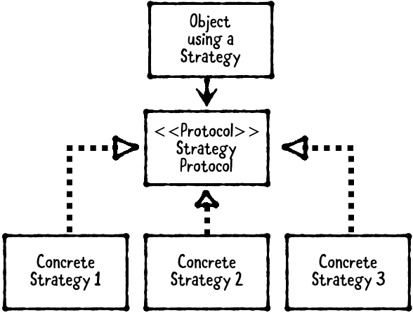

- **对象使用一个策略**，这个对象通常是 `ViewController`，但也可以是任何需要可交换行为的对象
- **策略协议**定义了所有策略必须实现的方法
- **策略**就是遵循了上面协议的对象

> 使用场合：
>
> 当你有两个或以上可以交换的行为时，使用策略模式
>
> 相比于代理，策略模式使用一组策略，更趋向易于在运行时改变

> **注意：**
>
> 同样不要滥用策略，比如在一个行为不会改变的情况下则不适用

### Singleton单例

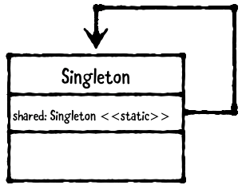

单例即一个类只有一个实例

> **注意：**
>
> 单例非常容易被滥用，如果你遇到需要使用单例的情况，首先考虑是否有别的方法

```swift
class AppSettings {
  static let shared = AppSettings()
  private init() { }
}

let appSettings = AppSettings.shared
```

### Memonto备忘录

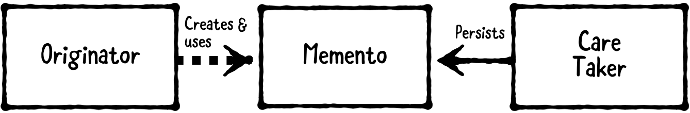

- **原发器**，是需要被保存或恢复的对象
- **备忘录**，代表一个存储状态
- **看管人**，从原发器请求保存，得到一个备忘录。看管人持久化存储备忘录，然后再提供给原发器用来恢复状态。

> 使用场合：
>
> 适用于存储对象状态且可以后续恢复的场合

### Observer观察者

- **Subject**，是被观察的对象
- **Observer**，即观察者

> 使用场合：
>
> 适用于当你需要接收别的对象改变的场合

```swift
// KVO
@objcMembers public class KVOUser: NSObject {
  dynamic var name: String
  public init(name: String) {
    self.name = name
  }
}

let user = KVOUser(name: "Weslie")
var observer: NSNSKeyValueObservation? = user.observe(\.name, options: [.initial, .new]) { (user, change) in 
	print("User's name is \(user.name)")                                                                                         }
```

### Builder建造者

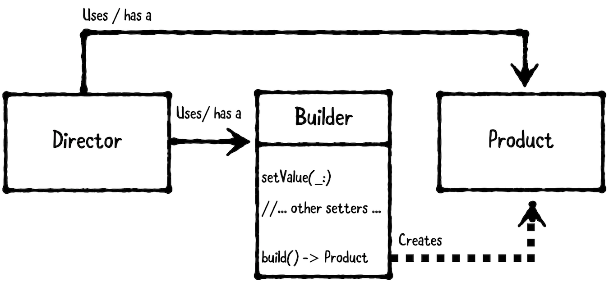

- **指挥者**接受建造者的输入和坐标，通常是一个 `ViewController` 或者辅助 `class`
- **产品**就是建造出来的复杂对象，通常是一个模型
- **建造者**接受一步步的输入来建造产品

> 使用场合：
>
> 适用于你想一步步来创建复杂的对象的场合，尤其是一个产品需要多个输入
>
> 反之，在你的产品不需要多个输入或者一步步创建的时候则不适用，这种情况就可以考虑便利初始化

## 中级

### MVVM

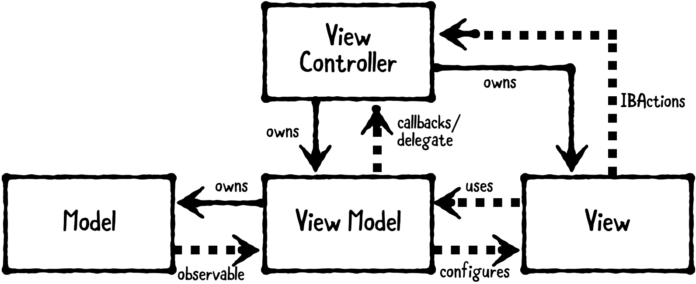

- **Models** 持有数据
- **Views** 展示视图和控件，通常是 `UIView` 的子类
- **Controllers** 协调 `Model` 和 `View`，通常是 `UIViewController` 的子类
- **ViewModel**把 `Model` 信息转换成 `View` 可以显示的值

### Factory工厂

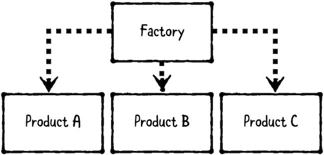

- **工厂**生产**产品**

> 使用场合：
>
> 适用于你想把创建对象的逻辑分离出来，而不是直接创建的场合
>
> 尤其是当你有一系列有关联的产品，比如多态的子类或者遵循相同协议的一系列对象的时候

### Adapter适配器

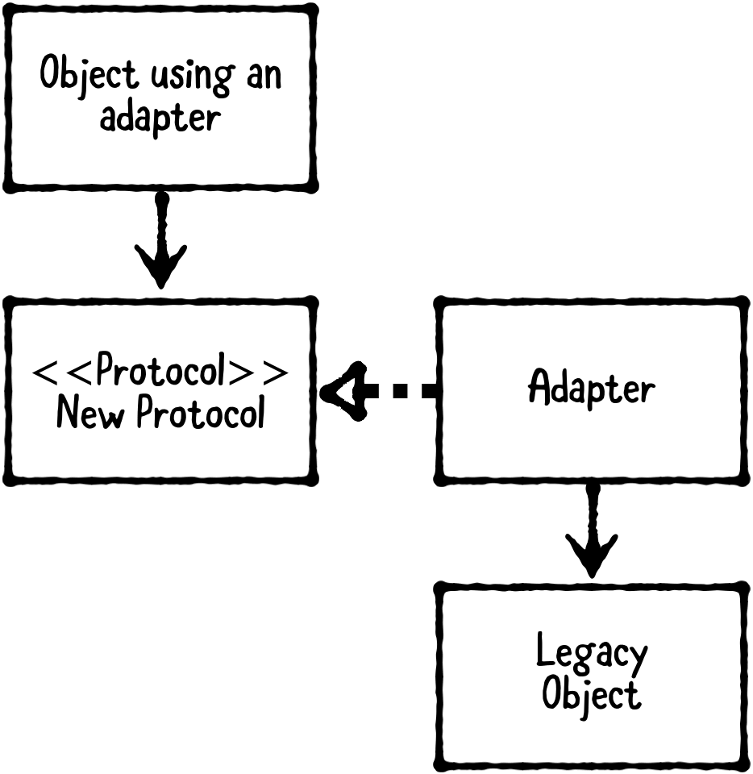

- 使用适配器的对象实现新协议，只关心协议返回的数据本身，无需关心被适配者
- **适配器**遵循新协议，持有被适配者对象（Legacy Object）
- **被适配者**（Legacy Object）无法直接被修改来遵循新协议

> 使用场合：
>
> 适用于在类、模块、函数可能无法被修改的情况，尤其是第三方库，有时你需要对它们进行适配

### Iterator迭代器

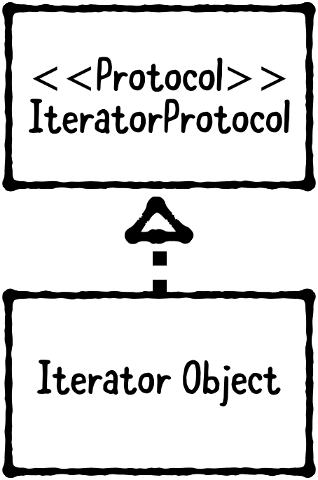

- Swift 的 `IterableProtocol` 定义了可以在 `for in` 循环中进行迭代的一个类型
- 通过遵循 `Sequence` 协议，你可以使用**自定义对象**来进行迭代，同时还能使用 `map` ，`filter` 等等高阶函数
- 不需要直接遵循 `IteratorProtocol` 协议

> 使用场合：
>
> 适用于当你有一个持有了很多有序对象的类或者结构体的场合，并且你希望用 for in 循环来遍历它

### Prototype原型

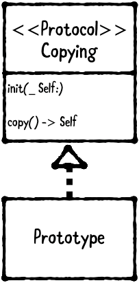

- 一个**复制**协议声明复制的方法
- **原型**类遵循复制协议

通常有两种不同类型的复制：浅复制和深复制

> 使用场合：
>
> 适用于需要对自身进行复制的对象

### State状态

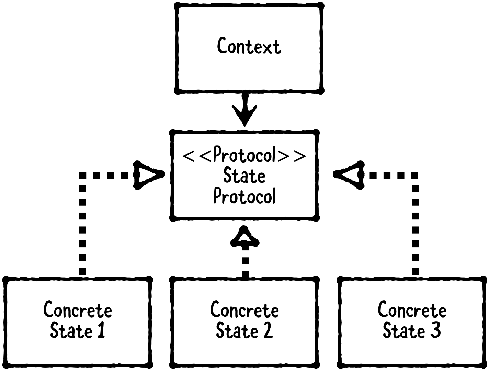

- **上下文**是一个定义当前状态并可改变内部行为的对象
- **状态协议**定义了所需方法以及属性，一般情况下用一个**基础状态类**代替协议，这样可以在其中定义存储属性。由于 Swift 没有抽象类这一说法，所以该基础状态类（抽象状态）不直接进行实例化，而是由其他子类（具体状态）继承
- **具体状态**继承抽象状态。因为上下文并不知道具体状态类型，所以它通过多态来改变行为，具体状态则定义了它如何进行改变

> 使用场合：
>
> 适用于创建一个拥有两个或以上状态并且会在其生命周期内改变的系统

### Multicast Delegate多播委托

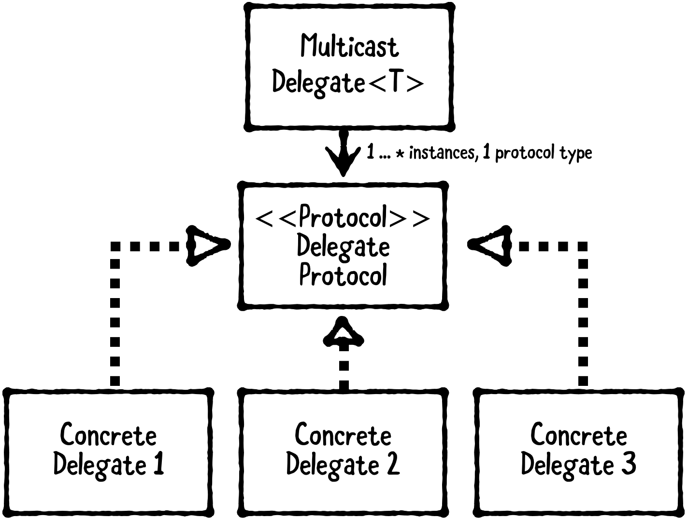

- **委托者**是有一个或多个代理的对象

- **代理协议**定义了可能需要实现的方法
- **代理**是一个实现了代理协议的委托对象
- **多播委托**是持有多个代理的辅助类，让你在代理事件发生时可以通知每个代理

> 使用场合：
>
> 适用于创建一对多的代理关系

### Facade外观

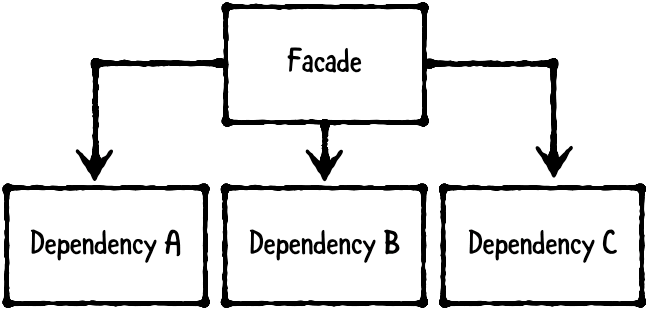

- **外观**提供与系统交互的简单接口，使用者只需使用外观，而不必关心系统的内部
- **依赖**即外观所持有的对象，每个依赖都执行复杂任务的其中一小部分

> 使用场合：
>
> 适用于有多个组件依赖的系统，同时你想给使用者提供简单的接口，这些接口对应会执行复杂的任务

## 高级

### Flyweight享元

享元模式提供了共享数据的对象来节约内存

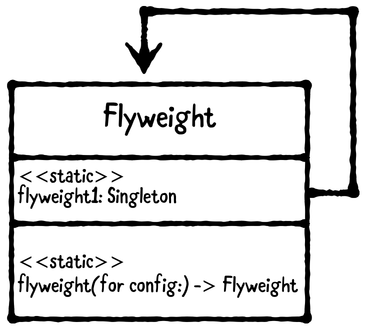

> 使用场合：
>
> 适用于单例且需要多个有不同配置信息的共享实例

### Mediator中介者

中介者是一个行为模式，封装了一组有相互通信的对象，可以改变程序运行行为

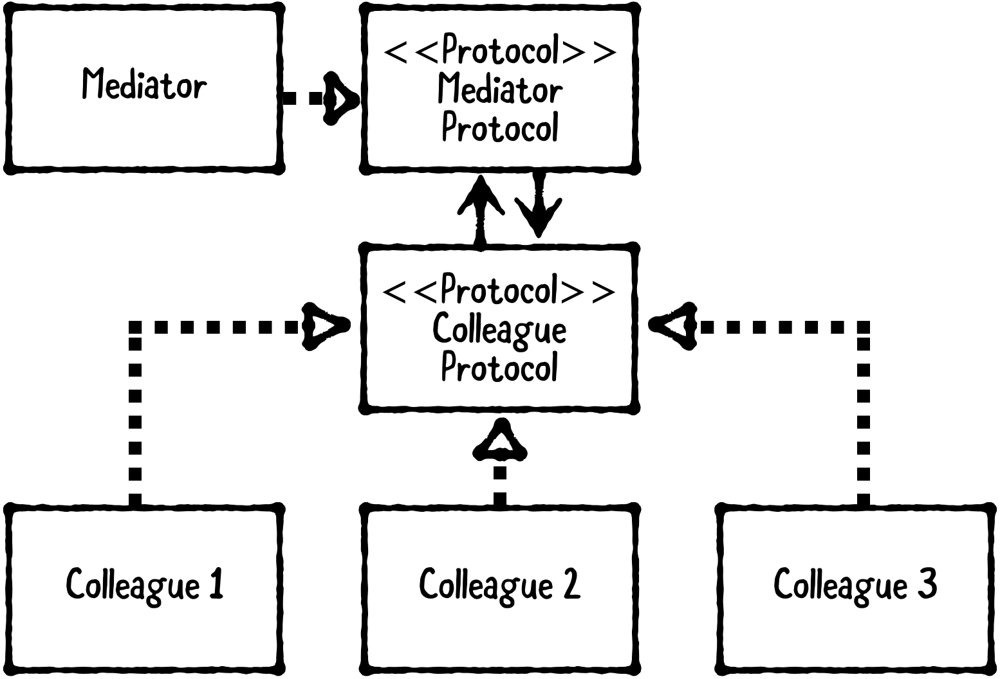

- **Colleague**是一组有相互通信的对象，它们实现了Colleague协议
- **Colleague Protocol**定义了每一个Colleague必须实现的方法和属性
- **Mediator**（中介者）是控制Colleague之间通信的对象，它实现了Mediator协议
- **Mediator Protocol**定义了Mediator必须实现的方法和属性

> 使用场合：
>
> 适用于给一组相互间有通信的对象解耦，封装中介者对象，可以独立改变它们之间的交互